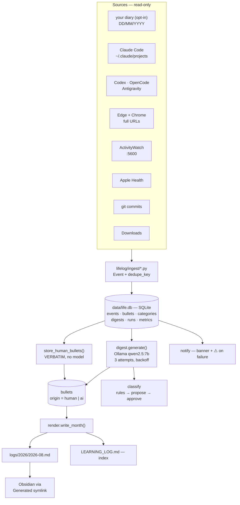

# Architecture — `lifelog`

How the pipeline is put together, and why each part is the way it is. Read
this before changing anything under `lifelog/`.

---

## 1. Principles

| # | Principle | Enforced by |
|---|---|---|
| P1 | **Local only.** No data leaves the machine. | `models.assert_local()` — raises if a remote model reaches the nightly path |
| P2 | **Raw events are append-only.** | No `UPDATE`/`DELETE` on `events`, anywhere |
| P3 | **Idempotent.** Any day re-runnable forever. | `dedupe_key` + `INSERT OR IGNORE`; `tests/test_lifelog.py::TestIdempotency` |
| P4 | **Markdown is a view, not a store.** | `logs/*.md` is regenerated from `life.db` on every run |
| P5 | **Your words are immutable.** | `bullets.HumanBulletProtected`; 5 tests |
| P6 | **Degrade, don't fail.** | Every source returns `(events, error)`; a dead source never aborts a night |
| P7 | **License-clean, zero runtime deps.** | Stdlib only, stock `/usr/bin/python3` |
| P8 | **Storage ceiling 200–400 MB/year.** | Body/title truncation on write; automatic compaction is not implemented yet |

---

## 2. Data flow



**Your bullets never pass through the model.** They go
`diary → events(source='journal') → bullets(origin='human')` verbatim. The model
receives them as *context only*, explicitly told not to reproduce them.

---

## 3. Storage — SQLite, and why not DuckDB

`life.db` is SQLite. **DuckDB would be a read-only lens, never a replacement**: it is
an OLAP engine, poor at the thousands of small row inserts a nightly ingest
does, and weaker on concurrent access. It reads SQLite directly
(`sqlite_scan('life.db','events')`), so adopting it for rollups later costs one
import and zero migration.

| Table | Purpose |
|---|---|
| `events` | Append-only raw signals. `dedupe_key` UNIQUE makes re-runs free |
| `bullets` | The product. `origin` (human/ai), `evidence`, edit chain via `superseded_by` |
| `categories` | Domains as data. `status` = active/proposed/merged. `merged_into` relabels old entries without rewriting markdown |
| `digests` | Generated overviews, versioned by model + prompt version |
| `runs` | Every attempt: `ok`/`partial`/`failed`, attempt count, per-source detail |
| `metrics` | Deterministic counts behind the dashboard, recomputable from `events` + `bullets` |

Full DDL: [`lifelog/db.py`](../../lifelog/db.py).

### Bullets — the editable core

An edit **inserts a new row and supersedes the old**; `UPDATE bullets SET text`
never happens. Automation cannot edit, reject or re-file a bullet the owner
wrote. One nuance, deliberately: *filing* may improve while *text* cannot — a
human bullet's `category_id` can be corrected by better rules, unless the owner
set it themselves (`edited_by='human-category'`), after which automation stops
touching it.

---

## 4. Domains — discovered, capped, never silent

```
bullet ─▶ stage 1: keyword rules (word-boundary, own line first)
             ├─ hit  ─▶ category assigned. Free, deterministic
             └─ miss ─▶ stage 2: the model may emit [New: Name]
                          └─▶ inserted status='proposed', invisible as fact
                               └─▶ you approve it: bin/approve.py or the web UI
                                    └─▶ classify.approve() → active
```

`config.DOMAIN_CAP = 15`. At cap, new proposals are refused rather than
sprawling. `classify.merge(a, b)` shrinks the set; old bullets keep their id and
relabel through `merged_into` at render time — which is why merging does not
contradict append-only.

Classification reads a bullet's **own line before its children**: a note titled
"Goodhart's Law" whose sub-point mentions money is Psychology, not Finance.
That case is a test.

---

## 5. Output format

`logs/<year>/<YYYY-MM>.md` (e.g. `logs/2026/2026-08.md`), newest day first.
The numeric name sorts correctly and cannot collide with a diary file of the
same month written as `08-August.md`.

`LEARNING_LOG.md` at the repo root is a generated index over the month files
plus a list of recent failed runs. It is gitignored.

```markdown
## 2026-08-11 (Tuesday)
> ⚠️ **Run partial** after 3 attempt(s) — ollama unreachable. …   ← only on failure

<2–4 sentence overview>

**Career**
- 🧍 Scheduled an HR screen for an AI engineering role
**AI Engineering**
- 🤖 Gained insight into how markitdown and context7 work.

**Proposed new domains — approve?**
- [ ] `cooking` — Cooking (proposed on 2026-08-11)   ← rendered for visibility;
      ticking it does nothing. Approve with `bin/approve.py` or the web UI

<sub>sources: browser=93, claude_code=2, downloads=3, journal=8</sub>
```

Rules: 2–4 sentence overview · 4–10 bullets · each ≤3 sentences · no prose
paragraphs · human bullets first, verbatim, nesting and language preserved.

---

## 6. Schedule and failure handling

**00:01 daily**, `com.lifelog.nightly` (launchd). The day being summarised is
therefore complete. `bin/nightly.py` defaults to **yesterday** and always writes
an explicit date into `runs`, so a run delayed by sleep still lands on the right
day instead of inferring "today" at write time.

Three layers of retry, because a silent miss is the failure that matters:

| Layer | Behaviour |
|---|---|
| Model call | 3 attempts, linear backoff, after waking Ollama with real sleeps between polls |
| Whole run | `bin/nightly.sh` retries 3× with 60s/120s backoff |
| Visibility | `runs` row + ⚠️ banner in the month file + failure list in `LEARNING_LOG.md` + notification |

A failed night still produces an entry: human bullets and raw signals are
already in the DB, so only the AI prose is missing.

---

## 6b. Rollups and the dashboard

**Chained, not scheduled separately.** `bin/nightly.sh` runs the daily job, then
`bin/rollup.py`, unconditionally. A second launchd timer would race the first;
"after the daily run" is an ordering requirement, not a clock one.

`rollup.daily_run_finished()` is the guard, and it deliberately accepts a
**failed** daily run — the requirement is that the day is *finished*, not that
it succeeded. `bin/rollup.py` re-checks the guard itself, so running it by hand
is safe.

| When | What |
|---|---|
| Day was a Sunday | Weekly review for the ISO week that just closed |
| Tomorrow is the 1st | Monthly review for the month that just closed |
| Every run | `Dashboard.md` regenerated |

Both land in **`logs/Summary.md`** — one file, monthly reviews then weekly,
newest first. Output: HIGHLIGHTS · BY DOMAIN · PATTERNS. The prompt is told to
trust 🧍 bullets over 🤖 ones where they conflict.

A period with fewer than `ROLLUP_MIN_DAYS` (2) logged days is skipped rather
than summarised into noise.

### Dashboard — plugin-free by design

`logs/Dashboard.md` uses **mermaid and markdown only**, both native to Obsidian.
No Dataview, no Charts View. Three reasons: it works in a vault with no
community plugins installed; it renders on the iPhone; and a product that
requires a customer to install third-party plugins — which can break when an
author moves on — is a worse product.

Contents: streak and totals · bullets/day sparkline + table · domain
distribution (bar + mermaid pie) · tracked screen time · proposed domains
awaiting approval · job health for the last 10 runs.

`lifelog/metrics.py` feeds it. Metrics are deterministic and fully recomputable
from `events` and `bullets` — no model involved.

---

## 7. Sources

Ten sources ship, all registered in `SOURCES` in `bin/nightly.py`. Every one
is optional: if the tool or path is absent, `available()` returns False and the
night continues without it.

| Source | Reads | Notes |
|---|---|---|
| `obsidian.py` | `<diary dir>/<year>/<MM-Month>.md` | **READ-ONLY, forever.** `DD/MM/YYYY` date lines, nesting preserved. **Opt-in**: set `obsidian_diary_dir` in `config/local.json` |
| `claude_code.py` | `~/.claude/projects/**/*.jsonl` | One event per session, keyed `(session, day)` |
| `agents.py` | Codex, OpenCode, Antigravity sessions | Three agents in one file; Antigravity needs a protobuf blob decoded out of a SQLite value |
| `browser.py` | Edge + Chrome `History` | Copied before reading (the live file is locked); 1601-epoch conversion tested |
| `activitywatch.py` | `localhost:5600` | App/window time. Skipped when the server is not running |
| `health.py` | Apple Health export dropped in iCloud Drive | Path overridable with `health_dir` |
| `misc.py` | git commits, `~/Downloads` | Scan roots from `git_scan_roots` in `config/local.json`; repos found one or two levels below each root |

Not built: shell history, Apple Notes, Preview.

---

## 8. Layout

```
bin/nightly.py      daily CLI: --day --backfill --force --dry-run --model --no-notify
bin/nightly.sh      launchd wrapper: 3 retries, then chains the rollup
bin/rollup.py       periodic: --period --key --day --force --skip-guard --model
bin/approve.py      approve / merge / reject a proposed domain
bin/ask.py          question your own log: --day --note --model --verbose
bin/serve.py        local web UI: --port --read-only --no-open
bin/mcp_server.py   MCP over stdio, 11 tools
lifelog/            config db bullets classify digest embed metrics models
                    notify query render rollup dashboard web
lifelog/ingest/     base + one file per source
config/             domain_registry.json · com.lifelog.nightly.plist.example
                    local.json — your machine's settings, GITIGNORED
data/life.db        canonical. GITIGNORED
logs/<year>/<YYYY-MM>.md  daily entries      ┐
logs/Summary.md           weekly + monthly   ├ generated, GITIGNORED,
logs/Dashboard.md         charts + health    ┘ symlinkable into a vault
tests/              106 unittest cases, stdlib only
```

---

## 9. Privacy boundary

`life.db`, `logs/`, `config/local.json` and `LEARNING_LOG.md` are all
gitignored: only code and docs reach a remote. Your diary is never copied into
the repo — the pipeline reads it where it already lives and writes nothing back.
No source sends anything off the machine, and `models.assert_local()` raises if
a remote model is ever wired into the nightly path.

---

## 10. Not built yet

| Not built | Note |
|---|---|
| Automatic compaction to hold the storage ceiling | Truncation on write is in place; old `app_use` detail is never rolled up |
| Approving a proposed domain by ticking the checkbox in a month file | The checkbox renders, but ticking it does nothing. Use `bin/approve.py` or the web UI |
| Reading hand-edits back out of the generated month files | Month files are a view and are overwritten. Edit through the web UI, or in your own diary |
| Shell history, Apple Notes, Preview | No source module |
| iPhone notes | No source module |

Built and often assumed otherwise: the yearly rollup (`--period year`), Apple
Health, ntfy push, semantic search and the MCP server all ship. Semantic search
does **not** use `sqlite-vec` — that needs a loadable SQLite extension, which
stock `/usr/bin/python3` is compiled without. Embeddings come from the local
model and the comparison is plain Python; see `lifelog/embed.py`.

---
